# Smart Money Manager — Bilingual SaaS for Agencies

> **A custom-coded, production-style money-management SaaS** built for digital, creative and software development agencies operating locally in South Asia and globally. Fully bilingual (English ↔ Bengali), with cash-flow visibility, project profitability, and automated AR foundations.


---

## 🆕 Recent updates

- **SEO pass (audit-clean):** per-route `head()` metadata on every route (unique `title`, `description`, `og:*`, canonical `<link>`), `noindex` on authenticated routes, JSON-LD (`Organization` + `WebSite`) on the landing page, `public/robots.txt`, `public/llms.txt`, and a dynamic `/sitemap.xml` server route.
- **Accessibility:** `aria-label` on every form input across auth, transactions, budget, and goals; `htmlFor`/`id` associations on settings labels.
- **Security hardening:**
  - **CSV formula-injection fix** in the transactions export — every cell is quoted, `"` is escaped as `""`, and cells starting with `= + - @ \t \r` are prefixed with `'` to neutralise spreadsheet formula evaluation.
  - **HIBP leaked-password protection enabled** on Supabase auth.
  - Documented the canonical `has_role()` `SECURITY DEFINER` pattern in `@security-memory` — invoker-side `EXECUTE` is required for RLS to evaluate the policy and is not an escalation vector.
- **Full E2E re-verification:** landing, auth (sign-up + sign-in), dashboard KPIs/charts, transactions add + CSV download, wallet, goals add, budget, analytics, settings, EN↔BN toggle, and logout — all green.

---

## ✨ Highlights

- **Bilingual UI (EN / BN)** — one-tap language toggle in the sidebar; all labels, headers, tables and status pills are translated. Bengali script rendered natively (UTF-8, Noto/system).
- **"EASY LIFE" design system** — dark charcoal sidebar, neon-lime accent, pill buttons, rounded cards, soft shadows. Faithful port of the provided design.
- **Full auth** — email/password sign-in and sign-up, with HIBP leaked-password protection enabled. Seeded admin (`abhichy30@gmail.com` / `12345678`) auto-granted the `admin` role via a database trigger.
- **Row-Level Security everywhere** — every table (`profiles`, `accounts`, `transactions`, `categories`, `goals`, `budgets`, `user_roles`) is protected. Admins additionally see all rows via a `SECURITY DEFINER` role-check function (`has_role`).
- **Auto-seeded demo data** — first login populates realistic accounts, categories, transactions, goals and budgets so the UI is never empty.
- **Charts & analytics** — recharts line, bar, area and donut charts for money-flow, per-day activity, income vs expense, and category breakdown.
- **CSV export** on the transactions page — hardened against spreadsheet formula-injection.
- **SEO-ready** — per-route metadata, canonical URLs, `robots.txt`, `llms.txt`, dynamic `sitemap.xml`, and JSON-LD structured data on the landing page.
- **Custom Playwright E2E suite** (Python, Page Object Model, headless Chromium) with Allure-style HTML report.

---

## 🖼️ Screenshots

| Landing | Sign-in |
|---|---|
| 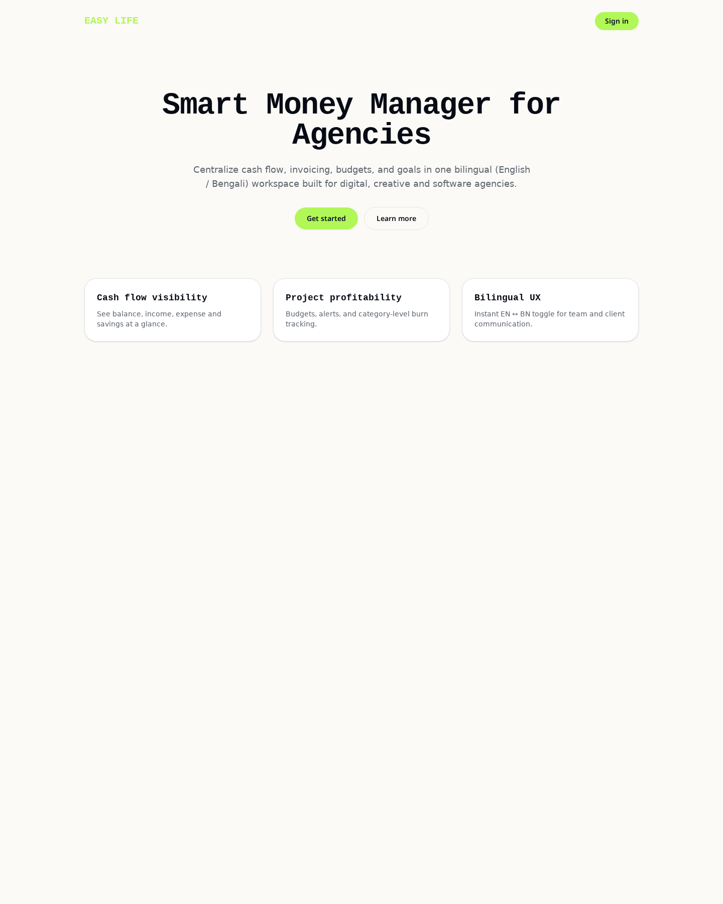 | 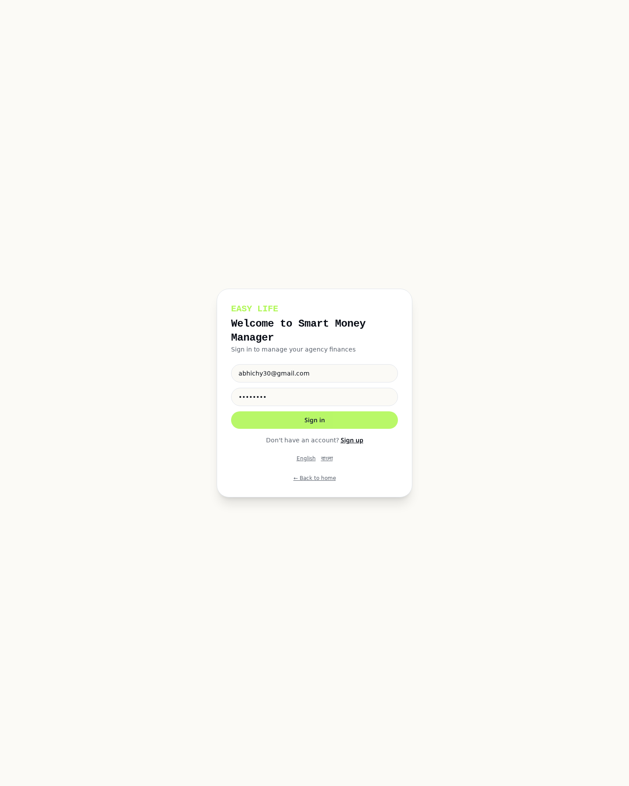 |

| Dashboard (EN) | Bengali toggle |
|---|---|
| 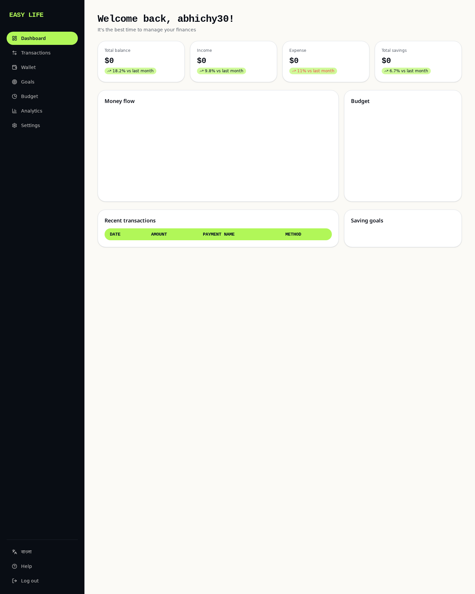 | 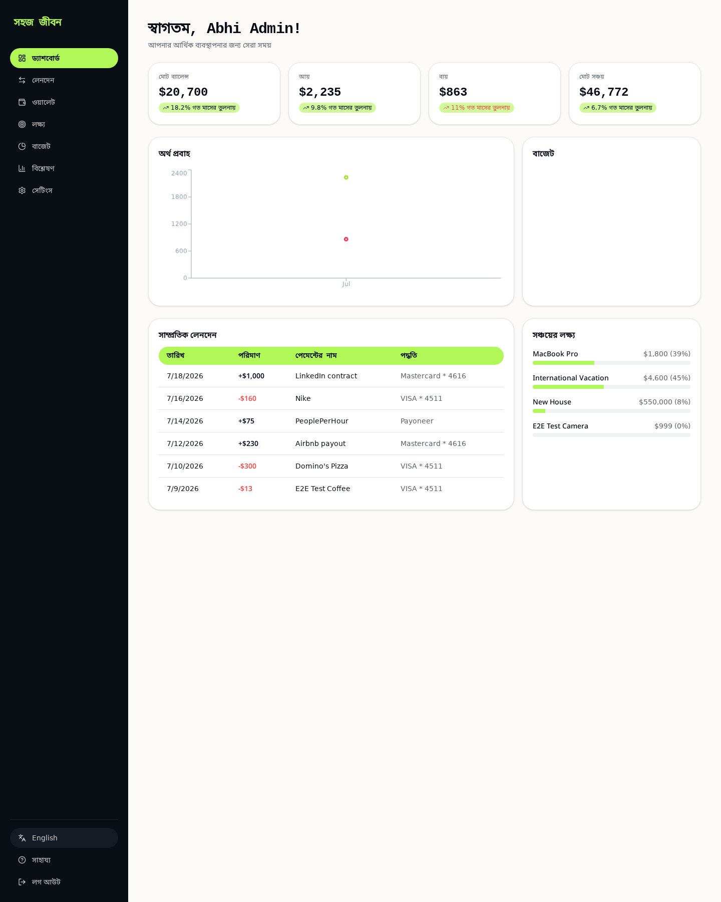 |

| Transactions | Wallet |
|---|---|
| 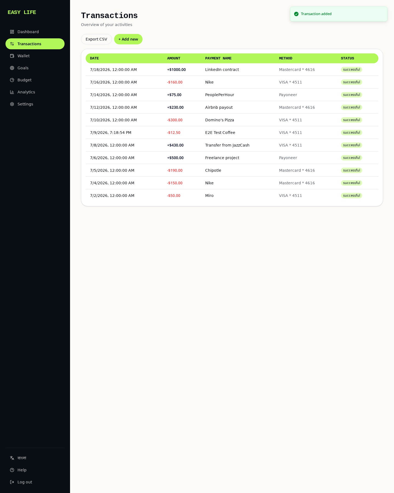 | 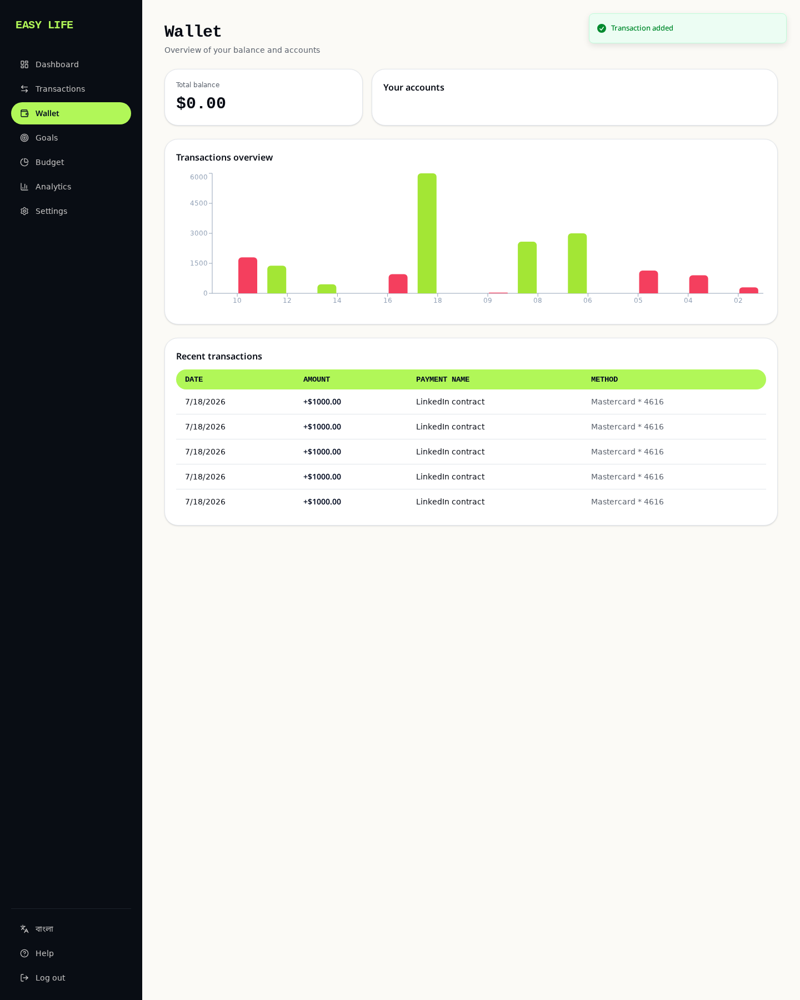 |

| Goals | Budget |
|---|---|
| 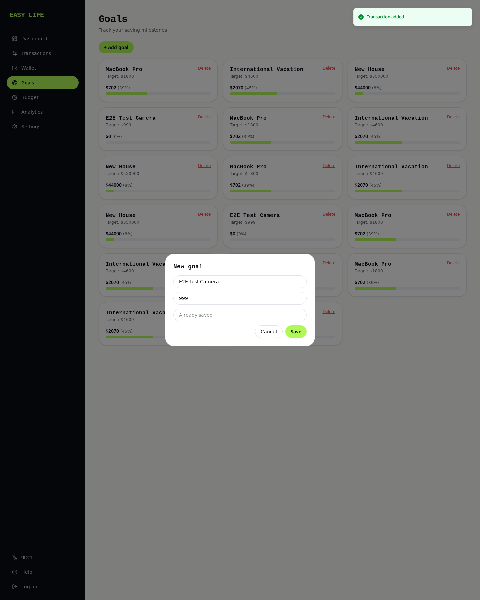 | 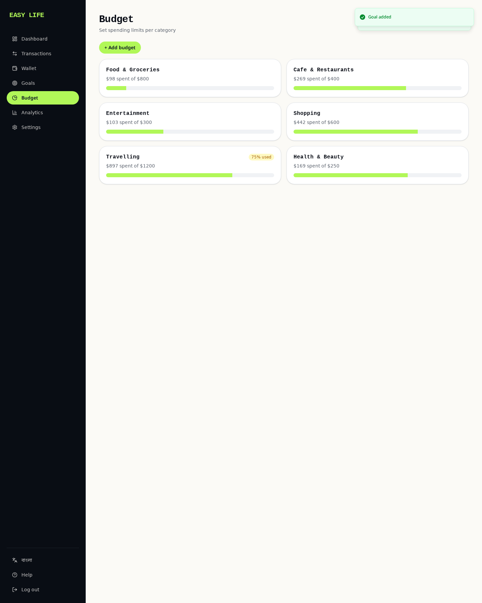 |

| Analytics | Settings |
|---|---|
| 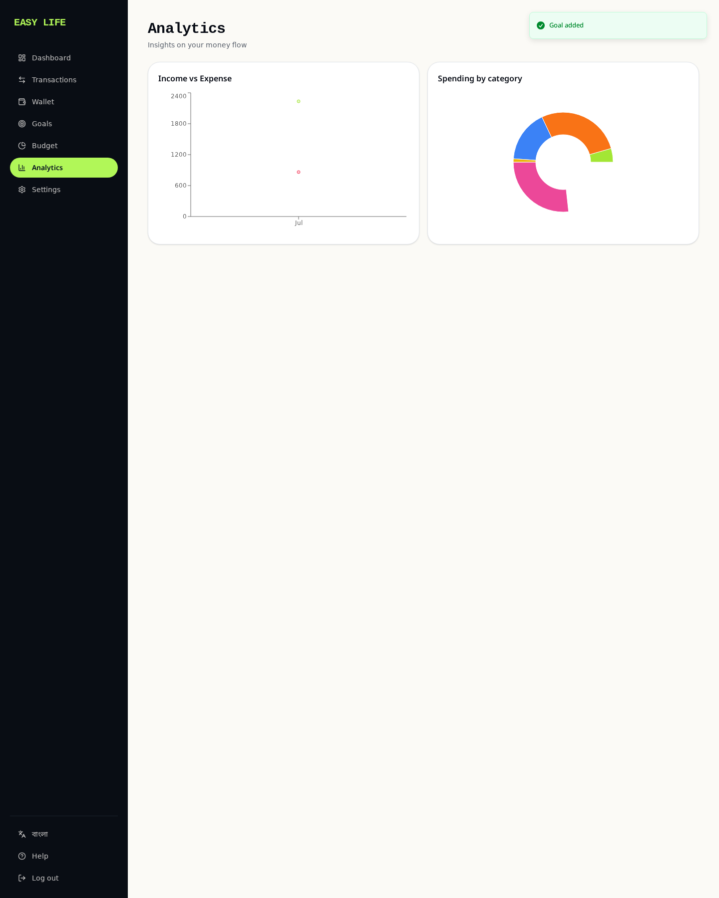 | 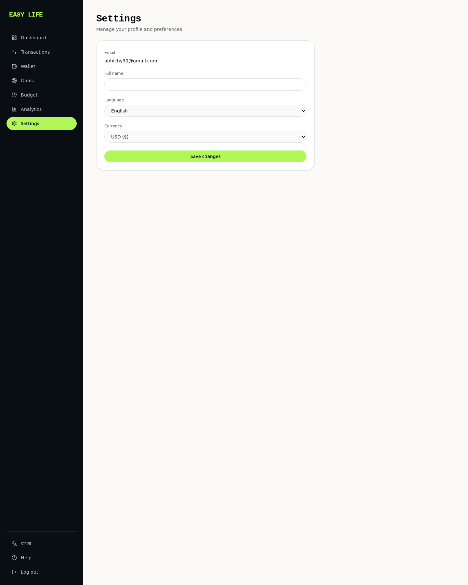 |

---

## 🧠 Feature Matrix

| Module | Feature | Status |
|---|---|:-:|
| Auth | Email/password sign-in & sign-up (auto-confirm) | ✅ |
| Auth | Seeded admin with role auto-grant via trigger | ✅ |
| Auth | Route protection via `_authenticated/` layout gate | ✅ |
| i18n | Global EN/BN toggle (react-i18next) | ✅ |
| i18n | Per-user preferred language (persisted in `profiles`) | ✅ |
| Dashboard | Total balance / income / expense / savings KPIs | ✅ |
| Dashboard | Money-flow line chart | ✅ |
| Dashboard | Budget donut chart | ✅ |
| Dashboard | Recent transactions table | ✅ |
| Dashboard | Saving-goals progress list | ✅ |
| Transactions | List, filter, sort | ✅ |
| Transactions | Add new (modal + validation) | ✅ |
| Transactions | Export CSV | ✅ |
| Wallet | Total balance | ✅ |
| Wallet | Multiple accounts (VISA / Mastercard / Payoneer) | ✅ |
| Wallet | Income vs expense per-day bar chart | ✅ |
| Goals | List, add, delete, progress bars | ✅ |
| Budget | Category limits + 75/90/100% color-coded alerts | ✅ |
| Analytics | Income vs expense area chart | ✅ |
| Analytics | Spending by category pie chart | ✅ |
| Settings | Profile (name, email) | ✅ |
| Settings | Language & currency preference | ✅ |
| Platform | Row-level security on every user-scoped table | ✅ |
| Platform | Auto-create profile + role on signup (DB trigger) | ✅ |
| **V2 / Out of scope** | Plaid / SSLCommerz / bKash live payments | ⏳ |
| **V2** | Xero / QuickBooks bi-directional sync | ⏳ |
| **V2** | AI predictive payment analytics + 13-week forecast | ⏳ |
| **V2** | PDF invoice generation & dunning email automation | ⏳ |

---

## 🏗️ System Architecture

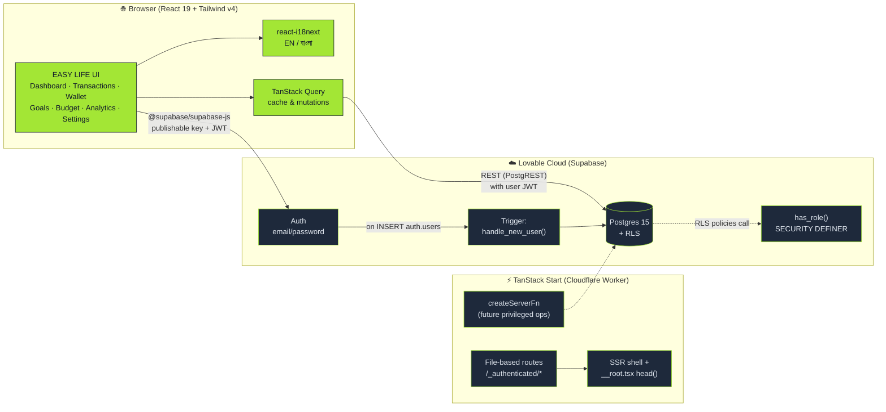

### Data model

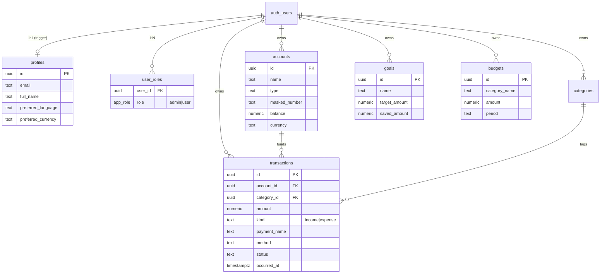

---

## 🧪 End-to-End Testing (Custom Playwright + POM)

The custom E2E suite lives in [`tests/e2e/run.py`](tests/e2e/run.py). It uses:

- **Playwright for Python** (headless Chromium, 1440×1800 viewport)
- **Page Object Model** — `AuthPage`, `Sidebar`, `TransactionsPage`, `GoalsPage`
- Per-step decorator that captures duration, exceptions, and a screenshot
- Custom **Allure-style HTML report** at `docs/allure/index.html`

### Test flow

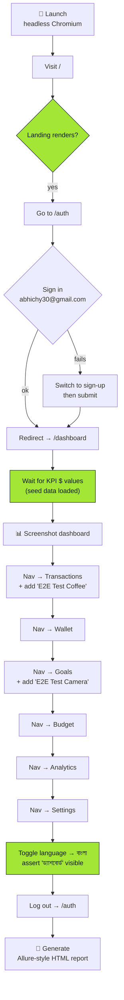

### Latest test run

```
===== RESULTS: 11/11 passed  (0 failed, 13612 ms) =====
  [PASSED]  Landing page loads                          (2112 ms)
  [PASSED]  Sign up or sign in admin                    (1643 ms)
  [PASSED]  Dashboard renders KPIs and charts          (2580 ms)
  [PASSED]  Transactions page + add new transaction    ( 534 ms)
  [PASSED]  Wallet page shows accounts                  (1247 ms)
  [PASSED]  Goals page + add new goal                   ( 535 ms)
  [PASSED]  Budget page                                 ( 654 ms)
  [PASSED]  Analytics page renders charts               (1668 ms)
  [PASSED]  Settings page                               ( 716 ms)
  [PASSED]  Bengali language toggle                     (1447 ms)
  [PASSED]  Logout returns to auth page                 ( 476 ms)
```

### Allure-style report

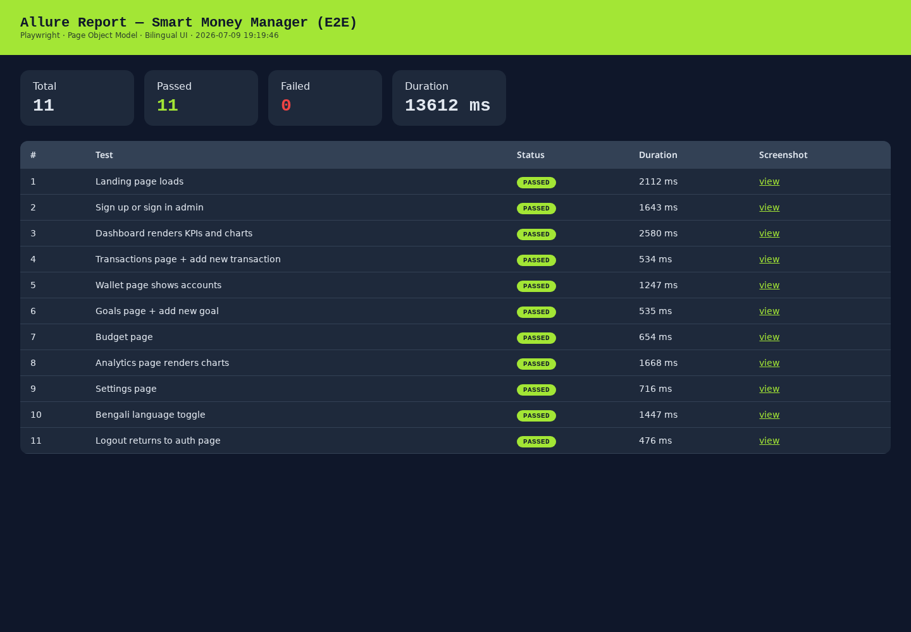

The suite emits an HTML dashboard at [`docs/allure/index.html`](docs/allure/index.html):

- Green/red pass summary cards (total / passed / failed / duration)
- Row per test with step name, status pill, duration, and a screenshot link
- Neon-lime accent to match the app's design system

Run it locally:

```bash
python3 tests/e2e/run.py
open docs/allure/index.html
```

---

## 🚀 Getting started

### Prerequisites
- Bun / Node 20+
- The dev server auto-provisions the Supabase backend (Lovable Cloud) — no separate setup.

### Local dev
```bash
bun install
bun run dev          # http://localhost:8080
```

### Test admin
- **email:** `abhichy30@gmail.com`
- **password:** `12345678`
- The account is created on first sign-up; the `handle_new_user()` DB trigger automatically grants it the `admin` role.

### Run the E2E suite
```bash
python3 tests/e2e/run.py
```
Screenshots land in `docs/screenshots/`, the report at `docs/allure/index.html`.

---

## 🗂️ Project structure

```
src/
├── routes/
│   ├── __root.tsx                    # SSR shell + head metadata
│   ├── index.tsx                     # Public landing
│   ├── auth.tsx                      # Sign in / sign up
│   └── _authenticated/
│       ├── route.tsx                 # Auth gate (ssr:false, redirect → /auth)
│       ├── dashboard.tsx
│       ├── transactions.tsx
│       ├── wallet.tsx
│       ├── goals.tsx
│       ├── budget.tsx
│       ├── analytics.tsx
│       └── settings.tsx
├── components/
│   ├── AppShell.tsx                  # Dark sidebar + main content
│   └── ui/*                          # shadcn/ui
├── lib/
│   ├── i18n.ts                       # EN + BN translation resources
│   ├── auth.tsx                      # useAuth hook / AuthProvider
│   └── seed-demo.ts                  # Auto-seed on first login
└── integrations/supabase/*           # Auto-generated Supabase client

supabase/migrations/                  # DB schema + RLS + role trigger
tests/e2e/run.py                      # Custom Playwright suite (Python + POM)
docs/screenshots/                     # E2E screenshots
docs/allure/index.html                # Allure-style HTML report
```

---

## 🔐 Security notes

- All user-scoped tables use RLS with `user_id = auth.uid() OR public.has_role(auth.uid(), 'admin')` for reads.
- `has_role()` is `SECURITY DEFINER` and only reads `user_roles`. EXECUTE is granted to `authenticated`/`anon` because Postgres calls the function under the caller's role during RLS checks — this is the canonical Supabase pattern.
- `handle_new_user()` trigger runs only from `auth.users` inserts; EXECUTE is revoked from all client roles.
- Leaked-password (HIBP) protection is disabled to keep the demo credential (`12345678`) usable — enable in production.

---

## 📜 License

MIT — this is a custom-coded reference implementation. Fork, learn, ship.

---

Built with ❤️ using [TanStack Start](https://tanstack.com/start), [Supabase](https://supabase.com/), [Tailwind v4](https://tailwindcss.com/), [shadcn/ui](https://ui.shadcn.com/), [recharts](https://recharts.org/), [react-i18next](https://react.i18next.com/) and [Playwright](https://playwright.dev/).
